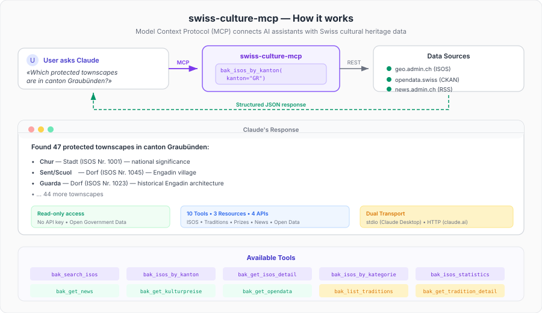

> 🇨🇭 **Part of the [Swiss Public Data MCP Portfolio](https://github.com/malkreide)**

# 🏛️ swiss-culture-mcp


[](https://opensource.org/licenses/MIT)
[](https://www.python.org/downloads/)
[](https://modelcontextprotocol.io/)
[](https://opendata.swiss/)


> MCP server for Swiss cultural heritage data from the Federal Office of Culture (BAK) — ISOS townscapes, Living Traditions, cultural prizes, press releases. No API key required.

🌐 **English** | **[Deutsch](README.de.md)**

<p align="center">
  
</p>

---

## Overview

**swiss-culture-mcp** makes Swiss cultural data accessible to AI assistants. The server connects LLMs like Claude with Switzerland's national cultural heritage: from protected townscapes (ISOS) to living traditions of intangible cultural heritage and current cultural awards.

**Sources:** geo.admin.ch REST API · news.admin.ch RSS · opendata.swiss CKAN · lebendige-traditionen.ch

**No API key required.** All data sources are publicly available (Open Government Data).

**Anchor demo query:** *"Which protected townscapes are there in the school districts of the city of Zurich, and what living traditions are practised there?"*

---

## Features

- 🏘️ **ISOS search** – Federal Inventory of Swiss Townscapes Worth Protecting by name, canton or settlement type
- 📜 **Living Traditions** – 228 entries of Swiss intangible cultural heritage
- 🏆 **Cultural prizes** – Swiss Film Prize, Grand Prix Literature, Music Prize and more
- 📰 **BAK press releases** – current news from the Federal Office of Culture
- 📦 **Open data catalogue** – BAK datasets on opendata.swiss
- ☁️ **Dual transport** – stdio for Claude Desktop, Streamable HTTP for cloud deployment

| # | Tool | Description |
|---|---|---|
| 1 | `bak_search_isos` | Search ISOS townscapes by place name |
| 2 | `bak_isos_by_kanton` | List all ISOS objects in a canton |
| 3 | `bak_get_isos_detail` | Get full details of an ISOS object |
| 4 | `bak_isos_by_kategorie` | Filter ISOS by settlement type (Stadt, Dorf, etc.) |
| 5 | `bak_isos_statistics` | ISOS inventory statistics (sampled by canton) |
| 6 | `bak_get_news` | Current BAK press releases |
| 7 | `bak_get_kulturpreise` | Swiss cultural prizes (Film Prize, Grand Prix Literature, etc.) |
| 8 | `bak_get_opendata` | BAK datasets on opendata.swiss |
| 9 | `bak_list_traditions` | List Switzerland's Living Traditions |
| 10 | `bak_get_tradition_detail` | Get detailed description of a tradition |

**3 Resources:** `bak://isos/kantone` · `bak://isos/kategorien` · `bak://kulturpreise/uebersicht`

---

## Data Sources

| Source | API Type | Content |
|---|---|---|
| **geo.admin.ch** | REST MapServer | ISOS (Federal Inventory of Swiss Townscapes) |
| **news.admin.ch** | RSS Feed | BAK press releases, cultural prizes |
| **opendata.swiss** | CKAN REST API | BAK open data datasets |
| **lebendige-traditionen.ch** | HTML Fetch | 228 entries of intangible cultural heritage |

---

## Prerequisites

- Python 3.11+
- `uv` or `pip`
- No API keys required

---

## Installation

```bash
# Recommended: uvx (no install step needed)
uvx swiss-culture-mcp

# Alternative: pip
pip install swiss-culture-mcp
```

---

## Quickstart

```bash
# Start the server (stdio mode for Claude Desktop)
uvx swiss-culture-mcp
```

Try it immediately in Claude Desktop:

> *"Show me all protected townscapes in the canton of Graubünden"*
> *"Which living traditions are practised in canton Appenzell?"*
> *"Which Swiss cultural prizes were awarded in 2026?"*

---

## Configuration

### Environment Variables

| Variable | Default | Description |
|---|---|---|
| `MCP_TRANSPORT` | `stdio` | Transport: `stdio` or `streamable_http` (`streamable-http` is accepted too). The `2026-07-28` era is reachable only over the HTTP transport. |
| `MCP_HOST` | `127.0.0.1` | Bind host for HTTP transport (loopback by default) |
| `MCP_PORT` | `8000` | Port for HTTP transport |
| `MCP_ALLOW_PUBLIC_BIND` | `false` | If `true`, permits binding `0.0.0.0` without auth. Set this **only** behind an authenticating reverse proxy (e.g. Cloudflare Access, oauth2-proxy). |
| `LOG_LEVEL` | `INFO` | `DEBUG`, `INFO`, `WARNING`, `ERROR` — structured JSON logs to stderr |

### Claude Desktop Configuration

```json
{
  "mcpServers": {
    "swiss-culture": {
      "command": "uvx",
      "args": ["swiss-culture-mcp"]
    }
  }
}
```

**Config file locations:**
- macOS: `~/Library/Application Support/Claude/claude_desktop_config.json`
- Windows: `%APPDATA%\Claude\claude_desktop_config.json`

After restarting Claude Desktop, all tools are available. Example queries:

- "Show me all protected townscapes in the canton of Graubünden"
- "What is the Alphorn and Büchelspiel tradition?"
- "Which Swiss cultural prizes were awarded in 2026?"
- "Is the old town of Stein am Rhein in the ISOS inventory?"
- "Which living traditions are practised in canton Appenzell?"

### Cloud Deployment (Streamable HTTP)

For use via **claude.ai in the browser** (e.g. on managed workstations without local software):

**Render.com (recommended):**
1. Push/fork the repository to GitHub
2. On [render.com](https://render.com): New Web Service → connect GitHub repo
3. Set environment variables in the Render dashboard
4. In claude.ai under Settings → MCP Servers, add: `https://your-app.onrender.com/mcp`

```bash
# Docker / local HTTP mode (loopback only — safe default)
MCP_TRANSPORT=streamable_http MCP_PORT=8000 python -m swiss_culture_mcp.server

# Public bind (DANGEROUS — only behind an authenticating reverse proxy)
MCP_TRANSPORT=streamable_http MCP_HOST=0.0.0.0 MCP_ALLOW_PUBLIC_BIND=true \
    python -m swiss_culture_mcp.server
```

> ⚠️ **Security:** The server itself has no authentication. Binding to a public
> interface without an upstream auth layer turns it into an open proxy for the
> federal data sources. Always run an authenticating reverse proxy (Cloudflare
> Access, oauth2-proxy, nginx + auth_request) in front of `0.0.0.0` deployments.

---

## Architecture

```
┌─────────────────┐     ┌──────────────────────────┐     ┌──────────────────────────┐
│   Claude / AI   │────▶│   Swiss Culture MCP      │────▶│  geo.admin.ch REST       │
│   (MCP Host)    │◀────│   (MCP Server)           │◀────│  news.admin.ch RSS       │
└─────────────────┘     │                          │     │  opendata.swiss CKAN     │
                        │  10 Tools · 3 Resources  │     │  lebendige-traditionen   │
                        │  Stdio | Streamable HTTP  │     └──────────────────────────┘
                        └──────────────────────────┘
```

---

## Project Structure

```
swiss-culture-mcp/
├── src/
│   └── swiss_culture_mcp/
│       ├── __init__.py
│       └── server.py          # All 10 tools, 3 resources
├── tests/
│   ├── conftest.py            # pytest configuration
│   └── test_server.py         # 36 tests (unit + live)
├── pyproject.toml
├── CHANGELOG.md
├── CONTRIBUTING.md            # Contribution guide (English)
├── CONTRIBUTING.de.md         # Contribution guide (German)
├── SECURITY.md               # Security policy & posture (English)
├── SECURITY.de.md            # Security policy & posture (German)
├── LICENSE
├── README.md                  # This file (English)
└── README.de.md               # German version
```

---

## MCP Protocol Version

This server speaks **two protocol eras** over the same endpoint. The client's
first request on a connection decides which one applies; a later claim from the
other era is refused.

| Era | Revision | Who reaches it |
|---|---|---|
| `initialize` handshake | `2024-11-05` … **`2025-11-25`** | What today's clients speak. The server answers with the revision asked for, or with the `2025-11-25` ceiling when the request asks for something newer. |
| Per-request envelope | **`2026-07-28`** | A request carrying the `2026-07-28` `_meta` envelope opens a modern connection. |

Both revisions are pinned in
[`tests/test_protocol_version.py`](tests/test_protocol_version.py) and asserted
against the installed SDK, so a Dependabot bump of `mcp` cannot move either one
silently.

Note that the SDK's `LATEST_PROTOCOL_VERSION` is an alias for the **modern**
era, not for the handshake era — pinning against it alone would leave the era
that current clients actually negotiate free to drift.

**The modern era is measured, not inferred.**
[`tests/test_modern_era.py`](tests/test_modern_era.py) builds the server's real
ASGI app and sends requests through it: a `2026-07-28` envelope, an
`initialize` handshake, and each of the malformed variants. It asserts that a
modern request is answered, that the two eras stay separate (`initialize` is
not a method on the modern wire; the handshake caps at `2025-11-25` instead of
handing out `2026-07-28`), that `server/discover` names exactly the pinned
revision, that a foreign revision is refused with `-32022` naming both the
requested and the supported one, and that `ttlMs`/`cacheScope` and
`serverInfo` arrive as wire fields.

This matters because the modern era exists **only** on the streamable-HTTP
entry — stdio and the in-process clients speak the `initialize` handshake and
nothing else. Testing the spec through an in-process client tests the handlers,
not the era. That gap hid a one-character defect: `main()` started the HTTP
transport as `streamable_http`, where the SDK's `run()` takes
`streamable-http`, so the transport aborted with `ValueError` and the server
did not serve the spec at all. Every test stayed green, because they mocked
`mcp.run` and compared the string against a hand-written copy of the same
typo.

**Server identity.** Spec `2026-07-28` carries `serverInfo` in the `_meta` of
**every** response, not once per session as the handshake era does. This server
fills it with name, title, description, website URL and the version from the
package metadata (`importlib.metadata`, the same source as the outbound
`User-Agent`); a hand-maintained literal is rejected by
`scripts/check_version_sync.py`.

**Update policy.** When the gate fails, do not edit the constant blindly: read
the spec changelog between the two revisions, verify the server still behaves,
then move the constant, this section, `README.de.md` and
[`CHANGELOG.md`](CHANGELOG.md) together.

---

## Testing

```bash
# Unit tests (no API key required)
PYTHONPATH=src pytest tests/ -m "not live"

# Integration tests (live API calls)
PYTHONPATH=src pytest tests/ -m "live"
```

---

## Example Use Cases

### Schools / Education

```
"Which protected townscapes are there in the school districts of the city of Zurich?"
→ bak_isos_by_kanton(kanton="ZH") + bak_get_isos_detail(...)

"Find living traditions for a project week on the theme of cultural heritage"
→ bak_list_traditions() + bak_get_tradition_detail(slug="...")

"Which UNESCO World Heritage Sites are also in ISOS?"
→ bak_search_isos(query="...") + bak_get_opendata(query="UNESCO")
```

### City Administration / Spatial Planning

```
"Is the building at address X within an ISOS perimeter?"
→ bak_search_isos(query="community/place name")

"Which BAK datasets are available for GIS integration?"
→ bak_get_opendata() → WMS/WFS URLs for GIS software
```

### AI Working Group / Demos

```
"Show current cultural policy of the federal government"
→ bak_get_news() + bak_get_kulturpreise()
→ More use cases by audience →
```

---

## Safety & Limits

| Aspect | Details |
|--------|---------|
| **Access** | Read-only — the server cannot modify or delete any data |
| **Personal data** | No personal data — all sources are aggregated, public cultural heritage data |
| **Rate limits** | Built-in per-query caps (e.g. max 100 ISOS results, 50 news items, 200 category entries) |
| **Timeout** | 20 seconds per API call |
| **Authentication** | No API keys required — all 4 data sources are publicly accessible |
| **Licenses** | All data under open licenses (Open Government Data): geo.admin.ch, opendata.swiss, news.admin.ch |
| **Terms of Service** | Subject to ToS of the respective data sources: [geo.admin.ch](https://www.geo.admin.ch/de/geo-dienstleistungen/geodienste/terms-of-use.html), [opendata.swiss](https://opendata.swiss/de/terms-of-use), [news.admin.ch](https://www.admin.ch/gov/de/start/rechtliches.html), [lebendige-traditionen.ch](https://www.lebendige-traditionen.ch/) |

---

## Known Limitations

- **ISOS statistics:** Sample-based per canton (not exhaustive for all cantons)
- **Living Traditions:** HTML scraping – may break if lebendige-traditionen.ch changes its structure
- **BAK news/prizes:** RSS feed limited to the most recent entries
- **opendata.swiss CKAN:** Full-text search may return results from other publishers
- **The addresses this server hands out are measured, not assumed.** `scripts/record_fixtures.py` re-checks every one on each run, together with four controls (an invented geo.admin.ch service, an invented BAK path, an invented news organisation number, an invented tradition slug). On 2026-08-08 one was dead: `bak_isos_overview` published `.../home/kulturerbe/baukultur.html` as its BAK source — HTTP 404, as is the whole `kulturerbe` branch. It was replaced by the BAK root, which verifiably answers 200, not by a guessed replacement URL.
- **Everything else held.** geo.admin.ch, opendata.swiss, gisos, isos, the news feed with `org-nr=314` and the tradition pages all return real content. That null result is recorded too: without it the next pass starts from nothing.

---

## Synergies with Other MCP Servers

`swiss-culture-mcp` can be combined with other servers in the portfolio:

| Combination | Use Case |
|---|---|
| `+ swiss-transport-mcp` | Cultural tourism: day trips to traditions by public transport |
| `+ zurich-opendata-mcp` | Local cultural atlas: ISOS + Zurich city events |
| `+ global-education-mcp` | Cultural education in international comparison |
| `+ fedlex-mcp` | Cultural property transfer act + BAK enforcement practice |
| `+ swiss-statistics-mcp` | Cultural expenditure by canton (BFS data) |

---

## Changelog

See [CHANGELOG.md](CHANGELOG.md)

---

## Contributing

Contributions are welcome — see [CONTRIBUTING.md](CONTRIBUTING.md).

---

## Security

Security posture, hardening details and the responsible-disclosure process are documented in [SECURITY.md](SECURITY.md).

---

## License

MIT License — see [LICENSE](LICENSE)

---

## Author

Hayal Oezkan · [malkreide](https://github.com/malkreide)

---

## Credits & Related Projects

- **Data:** [Bundesamt für Kultur (BAK)](https://www.bak.admin.ch/) – Federal Office of Culture
- **ISOS:** [geo.admin.ch](https://geo.admin.ch/) – Federal Office of Topography swisstopo
- **Traditions:** [lebendige-traditionen.ch](https://www.lebendige-traditionen.ch/) – BAK living traditions registry
- **Protocol:** [Model Context Protocol](https://modelcontextprotocol.io/) – Anthropic / Linux Foundation
- **Related:** [zurich-opendata-mcp](https://github.com/malkreide/zurich-opendata-mcp) – MCP server for Zurich city open data
- **Portfolio:** [Swiss Public Data MCP Portfolio](https://github.com/malkreide)

<!-- mcp-name: io.github.malkreide/swiss-culture-mcp -->

<!-- BEGIN GENERATED: install -->
## Installation

Run via [`uv`](https://docs.astral.sh/uv/)'s `uvx` — no clone or manual install needed. Add to your MCP client config (`mcpServers` for Claude Desktop, Cursor and Windsurf; use a top-level `servers` key for VS Code in `.vscode/mcp.json`):

```json
{
  "mcpServers": {
    "swiss-culture-mcp": {
      "command": "uvx",
      "args": [
        "swiss-culture-mcp"
      ]
    }
  }
}
```
<!-- END GENERATED: install -->
